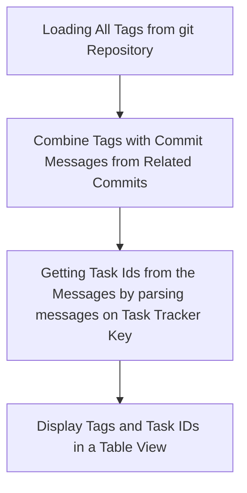

# GitTagsReport
The application provides information on commits with tags for building insights on key changes in the codebase.

The application assumes that the commit description includes a task number from a ticketing system, such as JIRA, and searches by the task number key to display them instead of the full commit text.

### Operating principle


## Usage

To use this tool, you must specify both the path to the git directory and the ticket system task key. Below are the required arguments:

- `-p`, `--path`    Required. Specifies the path to the git directory.
- `-k`, `--key`     Required. Specifies the ticket system task key.

## Example

```
utility.exe --path C:\Users\<user>\Documents\Code\Service --key AAA
```
### Output

```
 ------------------------
 | Tag    | Description |
 ------------------------
 | 1.2.1  | AAA-1306    |
 ------------------------
 | 1.2.0  | AAA-1285    |
 ------------------------
 | 1.1.4  | AAA-1300    |
 ------------------------
 | 1.1.3  | AAA-1299    |
 ------------------------
 | 1.1.2  | AAA-1298    |
 ------------------------
 | 1.1.1  | AAA-1296    |
 ------------------------
 | 1.1.0  | AAA-1205    |
 ------------------------
 | 1.0.1  | AAA-1229    |
 ------------------------
 | 1.0.0  | AAA-1136    |
 ------------------------

 Count: 9
```
